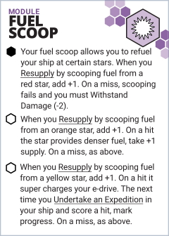

This asset for [Starforged](https://www.ironswornrpg.com/product-ironsworn-starforged) adds a fuel scoop module to your ship. Perfect for explorers charting systems in the Expanse or cheap traders who don't want to pay for fuel. Just don't fly too close!

## Fuel Scoop

* Your fuel scoop allows you to refuel your ship at certain stars. When you <u>Resupply</u> by scooping fuel from a red star, add +1. On a miss, scooping fails and you must <u>Withstand Damage (-2)</u>.

* When you <u>Resupply</u> by scooping fuel from an orange star, add +1. On a hit the star provides denser fuel, take +1 supply. On a miss, as above.

* When you <u>Resupply</u> by scooping fuel from a yellow star, add +1. On a hit it super charges your e-drive. The next time you <u>Undertake an Expedition</u> in your ship and score a hit, mark progress. On a miss, as above.

