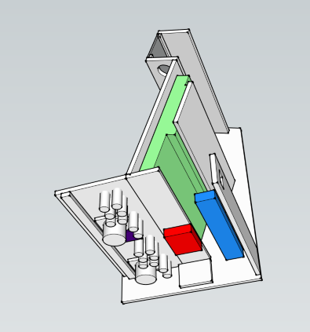
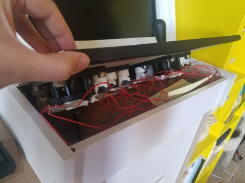
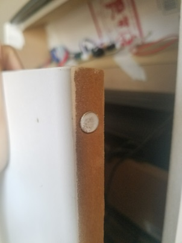
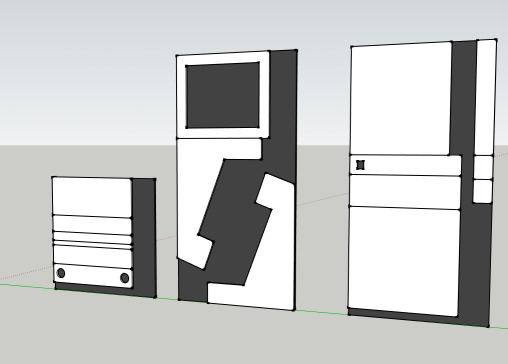
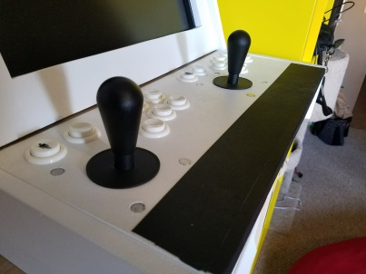

The first time I attended [Midwest Gaming Classic](https://www.midwestgamingclassic.com/) in 2016 (yes this post is 2 years late) I found custom-made arcade cabinets that were going for ~$600. Appalled at the price, I decided to accept the challenge no one gave me and build a cabinet for less than half the price!

I used [this awesome tutorial](http://www.instructables.com/id/2-Player-Bartop-Arcade-Machine-Powered-by-Pi/) for the foundation of my project and because its so great, I'm not going to reinvent the wheel and write new one. Instead this is meant to be a supplementary post for others who want build their own arcade cabinet.

## Do create detailed blueprints in Sketchup

I'm not usually one to plan things (yay spontaneity) but when I do, I try to be as detailed as possible. Since I didn't end up following the plans in the tutorial, I wanted to make sure that everything fit and I worked out any design problems BEFORE I started sinking money into materials.

My first pass in Sketchup was mostly for style and form factor. Since the cabinet was originally meant to sit on the breakfast bar at my old apartment I wanted to make it as compact as possible. Once had all of the parts sitting in front of me I did a second pass with the dimensions of everything to ensure it all fit.

## Do make a cardboard prototype

I unfortunately didn't take any WIP photos because I was so excited about building it, but I did follow the advice from the tutorial and build a full scale cardboard prototype. I honestly think trying to build the cardboard version was harder because I didn't have large enough scraps to make panels in one continuous piece. But it did the job and let me test out the size and button layout.

## Do add a removable control panel

Instead of permanently affixing the control panel to the cabinet, I wanted the panel to be removable for maintenance and if I wanted to swap out the control panel for a different layout at a later date. While I haven't built another control panel yet, this made the initial wiring so much easier because I didn't need to work in the tiny space under the panel.

## Do use Magnets

I added magnets to the backdoor panel because I didn't want to deal with any hinges. I had also planned to use magnets to hold down the control panel, but it fit so snuggly that I ended up not needing them.

## Don't be efficient

I don't do too much carpentry so I thought I was using my materials efficiently by not leaving gaps between the panels. What I realized as soon as I started cutting was that saw blades have a thickness, so all of my panels ended up being off by a few centimeters. Luckily sanding fixed most of the alignment issues.

## Don't skip the plexiglass control panel cover

I don't recall why skipped the plexiglass cover, but after a few uses dirt and grime started to show up on the white primer. I ended up just using some gaffers tape as a quick remedy, but eventually I'm going to pick up some plexiglass to protect the paint and wood. Plus I can tuck a cheat sheet under it for instructions or art.

## Don't skip plans for paint job or marquee

I just wanted a working arcade cabinet, so I didn't put any planning into the paint job or marquee. So now two years later, it's still a plain white with the speakers exposed. To mock my own lack of planning, the cabinet has been dubbed _Ghettocade_ with a piece of cardboard from the old prototype.

## Tools

* Table saw
* Power Sander
* Electric drill

## Materials

* IPAC (via [Focus Attack](https://www.focusattack.com/ultimarc-i-pac-2-2-player-usb-pushbutton-and-joystick-interface-pcb/))
* Buttons (via [Focus Attack](https://www.focusattack.com/suzo-happ-concave-long-stem-pushbutton-white/))
* Joysticks (via [Focus Attack](https://www.focusattack.com/suzo-happ-8-way-competition-joystick-black/))
* Wires (via [Focus Attack](https://www.focusattack.com/red-16pc-22-awg-wire-with-187-quick-disconnect/))
* Powerstrip (via [Amazon](https://smile.amazon.com/gp/product/B00TP1C1UC/ref=od_aui_detailpages01?ie=UTF8&psc=1))
* RaspberryPi (via [Amazon](https://smile.amazon.com/gp/product/B01C6FFNY4/ref=oh_aui_search_detailpage?ie=UTF8&psc=1))
* RaspberryPi Case (via [Amazon](https://smile.amazon.com/gp/product/B00ONOKPHC/ref=oh_aui_search_detailpage?ie=UTF8&psc=1))
* Desktop computer speakers (via [Amazon](https://smile.amazon.com/gp/product/B00GHY5JAO/ref=oh_aui_search_detailpage?ie=UTF8&psc=1))
* Wood Glue
* Magnets
* Monitor
* Keyboard
* MDF Boards

## Software

* [Retropie](https://retropie.org.uk/)
* [Google Sketchup](https://www.sketchup.com/)

## Stats

* Total cost: $264
* Total time (planning, construction, setup): ~5 days
* Nerd points obtained: 9000+
